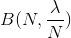
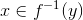
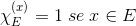
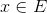
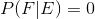

W.I.P.

## Indice
1. Variabili aleatorie discrete univariate
2. [Variabili aleatorie continue univariate](2.md)
3. [Analisi di variabili aleatorie univariate](3.md)
4. [Variabili aleatorie bivariate](4.md)
5. [Variabili aleatorie multivariate](5.md)
6. [Successioni di variabili aleatorie](6.md)
7. [Elementi di statistica](7.md)
8. [Home](../README.md)

## Variabili aleatorie discrete univariate
### Simbologia
 ("chi"): Variabile aleatoria, Insieme dei possibili casi.

k: Uno dei casi di .

N: Numero di ripetizioni dell'esperimento.

: Dominio dei valori che puo' assumere .

: Numero di volte in cui si verifica l'evento k.

.gif) (Frequenza): Indica quante volte si verifica l'evento k sul totale dei tent
ativi. 

&ensp;&ensp;&ensp;&ensp;&ensp;  &ensp;&ensp;&ensp;&ensp;&ensp; dove&ensp;&ensp;&ensp;&ensp;&ensp; 

 (Probabilita' Matematica): Si ottiene dalla 
frequenza per un numero elevato di tentativi.

&ensp;&ensp;&ensp;&ensp;&ensp; LEGGE DEI GRANDI NUMERI 
&ensp;&ensp;&ensp;&ensp;&ensp; (o legge empirica del caso) &ensp;&ensp;&ensp;&ensp;&ensp; 

&ensp;&ensp; la  deve soddisfare le seguenti condizioni:

&ensp;&ensp;&ensp;&ensp;&ensp;  &ensp;&ensp; (positivita')

&ensp;&ensp;&ensp;&ensp;&ensp;  &ensp;&ensp;&ensp;&ensp;&ensp; (normalizzazione)

S:&ensp; E' l'insieme supporto &ensp;&ensp;&ensp;&ensp;&ensp; 

### Variabile aleatoria discreta

Per variabile aleatoria si intende l'osservazione di una grandezza , che puo' assumere valori  (numeri interi)

### Distribuzione Di Probabilita' (ddp)

E' una funzione  che associa ad ogni  il suo valore di 

### Distribuzione Di Bernoulli ()

La ddp di Bernoulli riguarda variabili aleatorie con due soli casi possibili ( = 30, 14).

E' definita da:&ensp;&ensp;

dove

N: e' il numero di tentativi.

p: e' la probabilita' che si verifichi l'evento in un tentativo.

k: e' il numero di volte per cui si vuole che l'evento sia verificato

: e' il coefficiente binomiale

Per approssimare il fattoriale di numeri grandi si usa la formula di stirling&ensp;

### Distribuzione Di Poisson () o legge di probabilita' degli eventi rari

Puo' essere 
ottenuta dalla ddp di Bernoulli con un elevato numero di tentativi 
(), una bassa probabilita' 
() e .

Si ha una convergenza di legge da 
 a .

#### Dimostrazione
Dato&ensp;&ensp;

Scompongo N! e 
sostituisco p visto 
che &ensp;&ensp;

Semplifico (N-k)!, raccolgo N e scompongo 

Semplifico 

se 

abbiamo che:

A &ensp; 

B &ensp; 

C &ensp; 

da cui

### Distribuzione Geometrica ()

La distribuzione geometrica serve a calcolare la probabilita' di k 
successi consecutivi prima di un insuccesso. Puo' essere 
utilizzata quando la variabile aleatoria ha due soli casi 
possibili.

p: successi

1-p: insuccessi

### Funzione di Variabile Aleatoria Discreta (f.d.p.)

Data  v.a. discreta, con d.d.p. , definita in , ed una funzione  definita in  si puo' definire una nuova v.a. , la cui d.d.p.  e' definita come la somma di tutte le  t.c. , ossia, la probabilita' che si verifichi uno degli eventi x associati a y della funzione.

### Funzione caratteristica

Data la v.a. , definita in  e un insieme  si puo' definire una funzione  t.c.

Si puo' definire la d.d.p. di , detta  come la probabilita' che si verifichi uno degli eventi 

E' possibile usare le proprieta' degli insiemi per costruire eventi piu' complessi

- Se  (cioe' ), si dice che E e F sono INCOMPATIBILI, da cui: 
- Se  si dice che E e F sono INDIPENDENTI

### Probabilita' condizionale

Data una v.a.  con ddp  definita in  e un sottoinsieme .
La probabilità che si verifichi un evento x condizionata dall'evento E, è costituita dal numero di realizzazioni di x (Nx) sul totale di osservazioni (N), dalle quali si escludono quelle per cui il risultato , denotiamo con , il numero di realizzazione 

Da cui, per la legge empirica del caso, la ddp della v.a.  condizionata a E si puo' scrivere:
.
Piu' in generale, si puo' valutare la probabilita' di un altro evento F condizionato a E come
 Ossia la probabilita' che si verifichi F, nei soli casi in cui si verifica anche () E.

Nota:
<ul>
<li>Se , allora E e F sono incompatibili</li>
<li>Se , allora E e F sono indipendenti</li>
</ul>

### Funzione Di Ripartizione (fdr)

Data la v.a.  consideriamo la funzione definita in 

ossia la probabilita' che il risultato sia 
Nota: E' possibile definire la probabilita' di un evento del tipo  come 

ES.
Data un urna con palline numerate da 1 a 3 t.c. 
per 
per 
per 
per  Proprieta':
							<ul>
							<il> non negativa e non descrescente</li>
							<il> </li>
							<il> e' costante in ogni intervallo </li>
							</ul>
