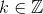

W.I.P.

## Indice
1. Variabili aleatorie discrete univariate
2. [Variabili aleatorie continue univariate](2.md)
3. [Analisi di variabili aleatorie univariate](3.md)
4. [Variabili aleatorie bivariate](4.md)
5. [Variabili aleatorie multivariate](5.md)
6. [Successioni di variabili aleatorie](6.md)
7. [Elementi di statistica](7.md)
8. [Home](../README.md)

## Variabili aleatorie discrete univariate
### Simbologia
 ("chi"): Variabile aleatoria, Insieme dei possibili casi.

k: Uno dei casi di .

N: Numero di ripetizioni dell'esperimento.

: Dominio dei valori che puo' assumere .

: Numero di volte in cui si verifica l'evento k.

.gif) (Frequenza): Indica quante volte si verifica l'evento k sul totale dei tent
ativi. 

&ensp;&ensp;&ensp;&ensp;&ensp;  &ensp;&ensp;&ensp;&ensp;&ensp; dove&ensp;&ensp;&ensp;&ensp;&ensp; 

 (Probabilita' Matematica): Si ottiene dalla 
frequenza per un numero elevato di tentativi.

&ensp;&ensp;&ensp;&ensp;&ensp; LEGGE DEI GRANDI NUMERI 
&ensp;&ensp;&ensp;&ensp;&ensp; (o legge empirica del caso) &ensp;&ensp;&ensp;&ensp;&ensp; 

&ensp;&ensp; la  deve soddisfare le seguenti condizioni:

&ensp;&ensp;&ensp;&ensp;&ensp;  &ensp;&ensp; (positivita')

&ensp;&ensp;&ensp;&ensp;&ensp;  &ensp;&ensp;&ensp;&ensp;&ensp; (normalizzazione)

S:&ensp; E' l'insieme supporto &ensp;&ensp;&ensp;&ensp;&ensp; 

### Variabile aleatoria discreta

Per variabile aleatoria si intende l'osservazione di una grandezza , che puo' assumere valori  (numeri interi)

### Distribuzione Di Probabilita' (ddp)

E' una funzione  che associa ad ogni  il suo valore di 

### Distribuzione Di Bernoulli ()

La ddp di Bernoulli riguarda variabili aleatorie con due soli casi possibili ( = 30, 14).

E' definita da:&ensp;&ensp;

dove

N: e' il numero di tentativi.

p: e' la probabilita' che si verifichi l'evento in un tentativo.

k: e' il numero di volte per cui si vuole che l'evento sia verificato

: e' il coefficiente binomiale

Per approssimare il fattoriale di numeri grandi si usa la formula di stirling&ensp;

### Distribuzione Di Poisson ()

